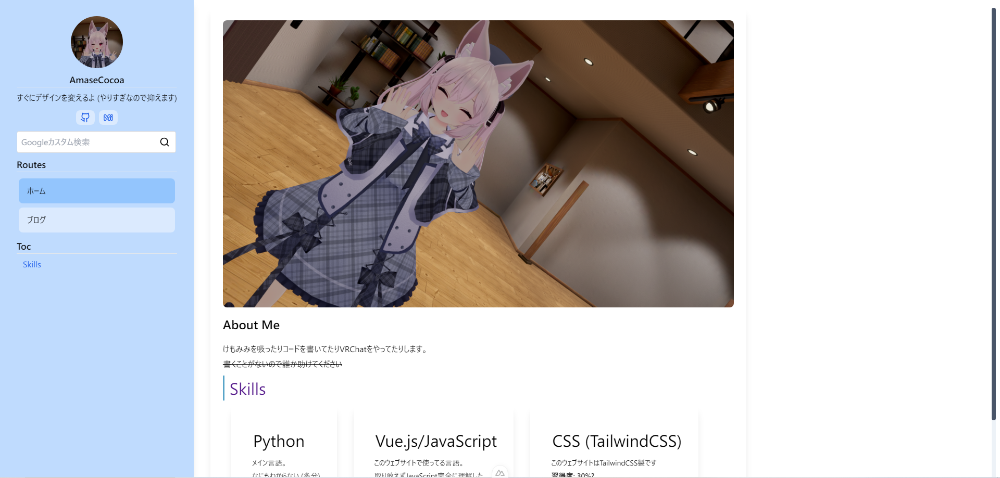

# About
けもみみを吸ったりコードを書いてたりVRChatをやってたりします。

## Skills
### Python
* メイン言語。
* なにもわからない (多分)

習得度: 80%?
### Vue.js/JavaScript
* 旧ウェブサイトに使ってた言語。
* 完全に理解した

習得度: 20%?
### CSS (TailwindCSS)
* TailwindCSSだいすき

習得度: 50%?
## My Works
### amase.xyz (2rd Gen)
ちょっと前まで使ってたウェブサイト。バグまみれなので廃止済み。
Nuxt.js (ISR)とTailwindCSSを使ってるよ。

### Firefly (Old: Holo)
Misskey互換のActivityPubサーバー。バックエンドとフロントエンドは分離されていてPleromaみたいに置き換えできます。

::github{repo="joinfirefly/backend"}
### media-proxy
MisskeyのMedia ProxyをPythonで実装したもの。初期と比べて画像処理やメディアの取得が高速化されているのでそこそこ速い。

::github{repo="AmaseCocoa/media-proxy"}
### summaly-py
Misskeyのsummaly ProxyをPythonで実装したもの。(できるだけ速度を上げようとしたものの)遅い気がする

::github{repo="AmaseCocoa/summaly-py"}